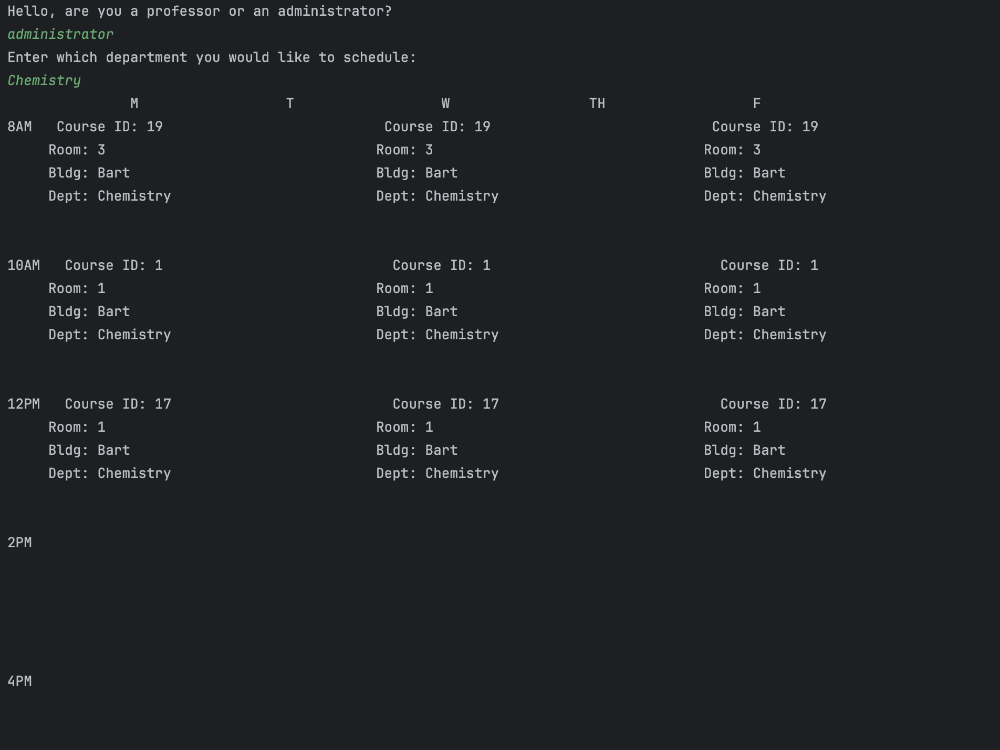

# Course Scheduler

Course scheduler is a Java program that takes in a set of available time slots, 
rooms and courses to be scheduled and outputs a valid course schedule in
calendar format. 

There can be 2 types of users for course scheduler: university professors 
and administrators.

- Professors will be able to add a course to be scheduled. Once added, a
  valid schedule will be displayed.
- Administrators will be able to input the departments they are a part of and
  be shown a valid schedule with courses from that department that has been
  inputted. They will not be able to add any courses to be scheduled.

## Usage

 To run course scheduler, go to src/SchedulerGenerator and run the main
 method. Users will be able to interact with the program through a command line
 interface.

## Sample output

## Implementation

To generate a valid schedule, courses are inputted by users and mapped to a room
based on department and capacity on construction.

The program builds a graph where nodes represent courses to be scheduled, 
and edges represent a conflict between adjacent nodes (i.e., overlapping instructor or room need).

Union-find is utilized to identify the connected components in the graph.

Then, independent sets are formed by picking one node from each of the connected
components until no nodes are left. 

Lastly, since each independent set contains courses that are guaranteed to have no
conflicts among them, each set can be mapped to a timeslot available in the 
schedule. A calendar can be outputted based on this mapping.
